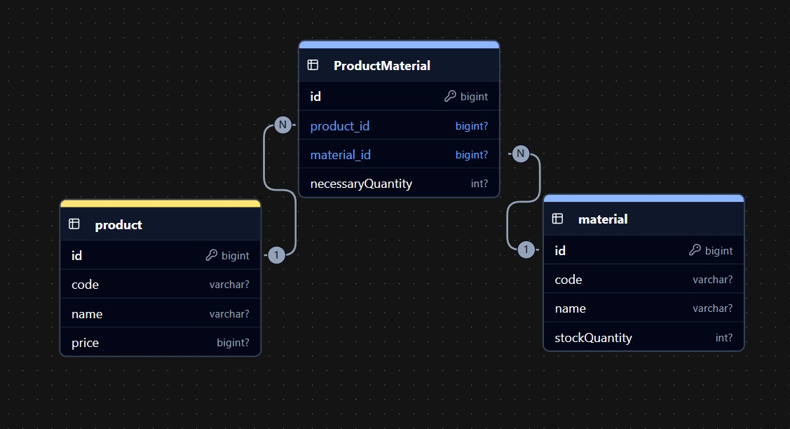

# Api Autoflex

# 📋 Descrição do Projeto
Esta API RESTful foi desenvolvida para um teste técnico, oferecendo recursos para cadastro de produtos, matéria prima e relacionamento dentre eles.
Com ela, é possível:

- ``Cadastrar, consultar, atualizar e remover produtos``
- ``Cadastrar, consultar, atualizar e remover matérias-primas``
- ``Definir quais matérias-primas são necessárias para fabricar cada produto``
- ``Controlar o estoque de matérias-primas``
- ``Gerar sugestões de produção com base no estoque disponível e no valor dos produtos``

## Diagrama de Classes (Domínio da API)

## ✔️ Técnicas e tecnologias utilizadas

- ``Java 17``
- ``InteliJ IDEA``
- ``Paradigma de orientação a objetos``
- ``Spring Boot``
- ``Spring Data JPA``
- ``Hibernate``
- ``RESTful APIs``
- ``PostgreSQL``
- ``Maven``
- ``DTO (Data Transfer Objects)``
- ``Swagger``
- ``Insomnia``

## 🚀 Como Executar o Projeto
- ``Pré-requisitos``
- ``Java 17 ou superior``
- ``Maven instalado``

## Swagger
- ``http://localhost:8080/swagger-ui/index.html``